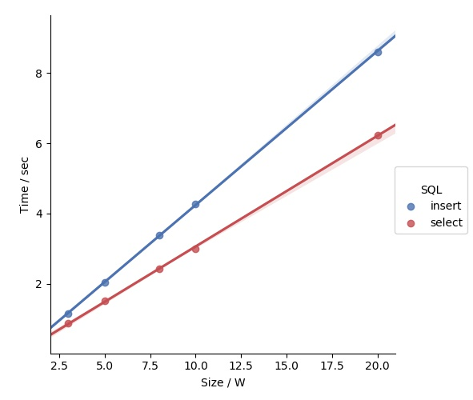

# sBase

sBase is an implementation of relational database system written in C++11. 

## Features

* Multiple storage engine: B-link, Hash, LSM(?), B-flow

* Basic SQL command support and simple SQL planner

* Concurrency control and simple transaction

* Multi-threaded connect and network connect(?)

* Efficient SQL parser and generator with C++ template

## Design

* `Compiler`: Encapsulate a minimal virtual machine base on context-free grammar. The implementation explores some nice C++11 features to simplify the encoding.

* `Engine`: Middleware between front-end and storage functionality. Provide intuitive interface for most simple operation.

* `Cursor`: Performer of concrete storage operations. In B-link case, there're BFlowCursor and BPlusCursor, which respectively serve to maintain records piece and index.

* `PageManager`: Buffer manager, also controller of concurrent request. Plain C++11 api like mutex and condition_variable are used to construct more complex locks, including write-lock, read-lock, weak-write-lock.

* `Reflection Support`: To better styling the manipulation of runtime type, I implement a reflection system, in which value are wrapped in uniform Value object.

## to-be-continued

* More Concurrency
  * Concurrency Control
    * Lazy Persistency
  * Data Structure Protocol
* Faster Access
  * Faster Disk Access
    * B-Flow Tree: leverage sequential seek
      * each page is mixture of take-only, normal, put-only area
      * page is kept half-filled
      * no splitting in the middle of file, data file is maintained sequential
  * Better Memory Locality
    * Predictor and Prefetch

## Build

* Originally built with g++. Makefile styled for microsoft nmake tool.
* `nmake sbase` to compile under WIN environment with VS tool.

## Performance

### Single-threaded w/r

